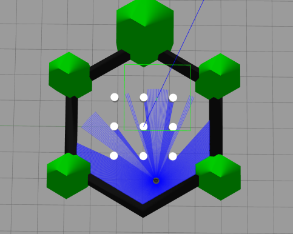
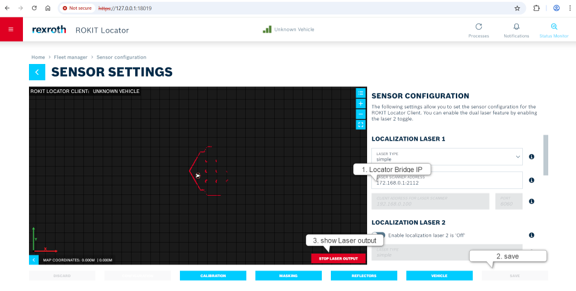
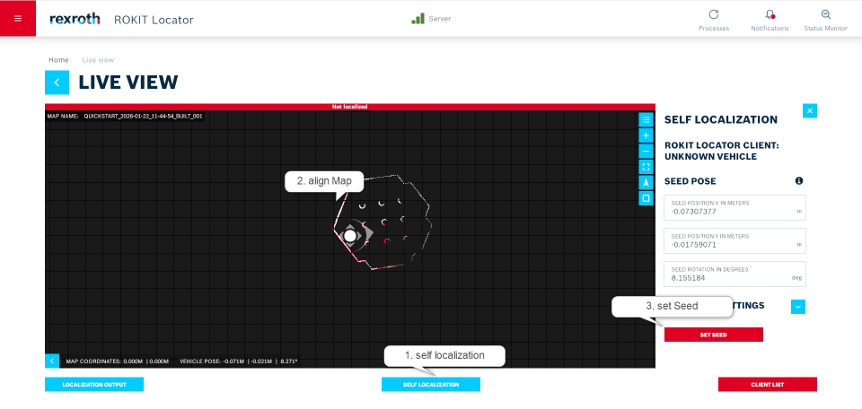
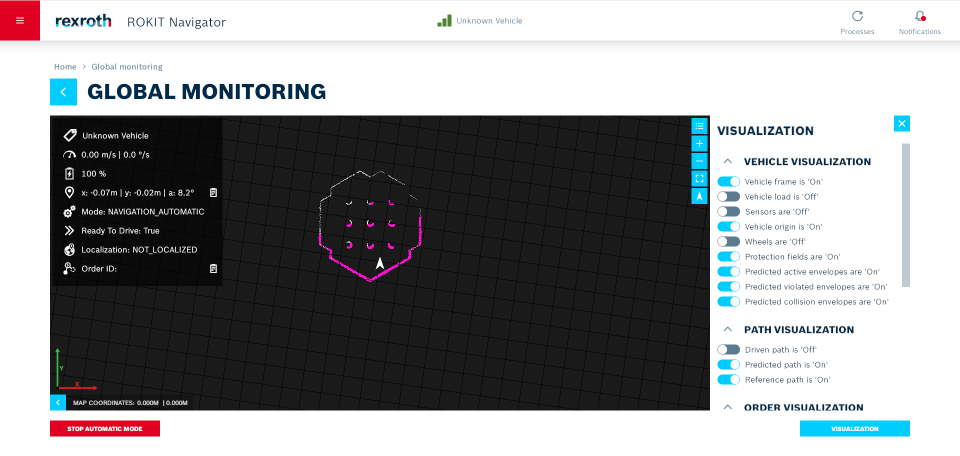

# Example for the Navigator Bridge with Gazebo

This example provides a complete setup to test the functionality of the Navigator Bridge and the Locator Bridge. It uses a TurtleBot3 robot in a Gazebo simulation to provide a virtual environment, allowing you to verify the entire data flow from localization with simulated sensor data to the execution of a navigation order sent via MQTT.

## Prerequisites

### Server and Clients are Running:

- The NavigatorClient is running
- The LocatorClient is running
- The LocatorServer is running

## Step-by-step Instructions

### Installation Instructions

Instead of performing the installation manually, you can also simply use the provided devcontainer.
First, the following packages need to be installed: 
```bash
    apt-get update && apt-get install -y \
    ros-humble-nav2-util\
    ros-humble-ros-gz \
    ros-humble-turtlebot3-gazebo \
    ros-humble-turtlebot3-teleop \
    mosquitto mosquitto-clients
```
After installation, build the packages for the Navigator Bridge and the Locator Bridge with colcon, as described in the main README.md. ([main README.md](../README.md))

### Start the Simulation

Once all necessary packages are installed, you can start the simulation using its launch file.

Set the TurtleBot3 Model:
```bash
    export TURTLEBOT3_MODEL=burger
```

Source the ROS 2 Environment:
```bash
    source /opt/ros/humble/setup.bash
```

Launch the Simulation:
```bash
    ros2 launch turtlebot3_gazebo turtlebot3_world.launch.py
```

If everything worked, it should look like this:




Once the simulation is running, the Navigator Bridge and the Locator Bridge can be built and launched. It is recommended to use the two provided launch files, as no further changes to the configuration of the Navigator and the Locator will then be required.

### Localization


An important issue for localization is that the laser scanner data may have an incorrect timestamp. For this reason, the time_start must be changed to the current timestamp in the file locator_ros_bridge/bosch_locator_bridge/src/rosmsgs_datagram_converter.cpp on line 464.

| before changing | after changing |
|---|---|
|  ```writer << (static_cast<double>(msg->header.stamp.sec) +1e-9 * static_cast<double>(msg->header.stamp.nanosec)); ```|```  writer << rclcpp::Clock{}.now().seconds(); ```|

#### Connect the Locator with the Sensor Data

- Open the web GUI of the Locator Server aXessor using the Locator's IP address and port 18019
- Open the web GUI of the Locator Client aXessor using the Locator's IP address and port 18018
- Log in with your username and password
- Add a new vehicle: Fleet Manager-> add new vehicle
- For execution, use the provided launch file. This file configures all simulation-specific settings.([launch file Locator](launch/example.launch.locator.xml ))
  ```bash
  ros2 launch example_rokit_ros_bridge example.launch.locator.xml
  ```
- You can visualize the incoming laser data by clicking start laser output: Fleet Manager -> Vehicle -> Sensor Settings
  
 

#### Begin the Localization Process

- Return to the Home page
- Upload an existing map via Maps -> Sketches -> upload ([Map Simulation](testingfiles_rokit_ros_bridge/gazebo_example_Map.tar))
- After completing these steps, you can start the localization: Home -> Live View -> Client List -> start -> self localization -> Align Map -> set seed
  
    

### Navigator


#### Change the Navigator Configuration

- Open the web GUI of the Navigator aXessor using the Navigator's IP address and port 18020
- Log in with your username and password 
- For execution, use the provided launch file. This file configures all simulation-specific settings.([launch file Navigator](launch/example.launch.navigator.xml )
  ) 

  ```bash
  ros2 launch example_rokit_ros_bridge example.launch.navigator.xml
   ```
   
- Important! You must change the IP address of the bridge if it is different from the one in the configuration.

#### Start the MQTT Broker

- Start the broker with the following command in your terminal:
```bash  
    mosquitto -v
```

#### Start Automatic Mode

- Activate the mode here: Home -> Global Monitoring -> Start Automatic Mode
  
    


### Send an order
When the previous steps work, then start driving.
Here is an order that can be sent via MQTT: [Order](testingfiles_rokit_ros_bridge/order.json )

using the following command:

```bash
    mosquitto_pub -h <host_address> -p 1883 -t "uagv/v2/bosch/0001/order" -f order.json
```
